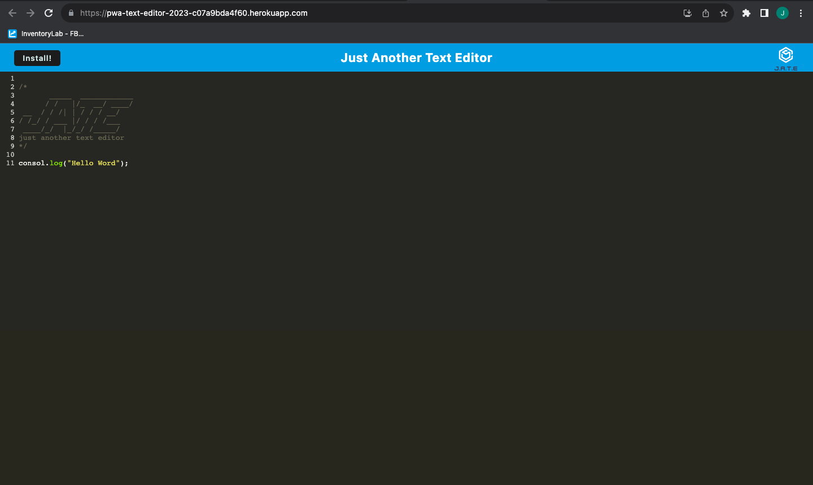
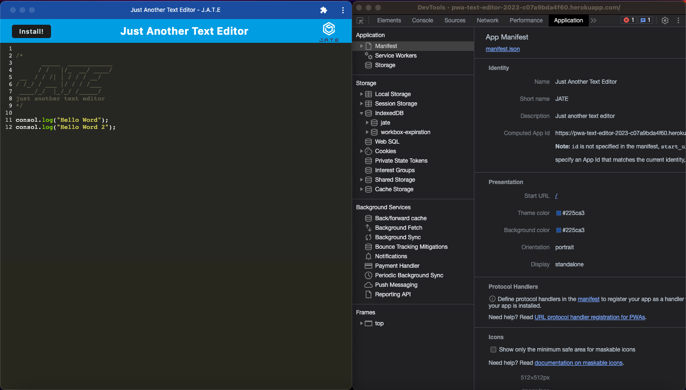
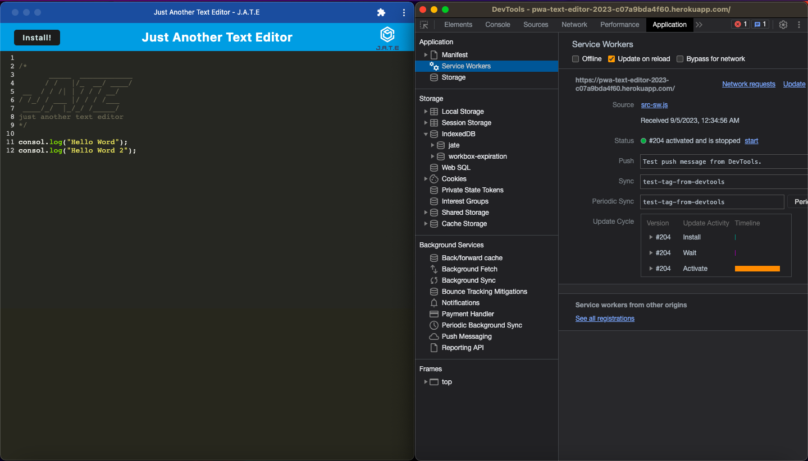
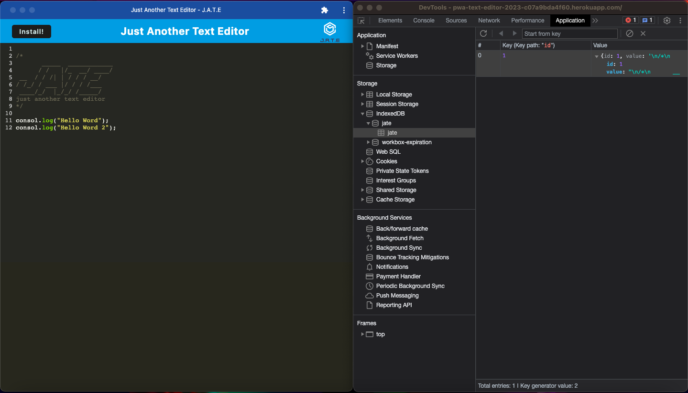

# Progressive Web Application (PWA): Text Editor 

### Table of Contents
- [Introduction](#introduction)
- [User Story](#user-story)
- [Acceptance Criteria](#acceptance-criteria)
- [Technologies Used](#technologies-used)
- [Application Features](#application-features)
- [Mock-Up](#mock-up)
- [Deployed Application Link](#deployed-application-link)
- [License](#license)
- [Contributing](#contributing)
- [Questions](#questions)

## Introduction
Welcome to the Text Editor Progressive Web Application (PWA) project! In this project, I built a feature-rich text editor that runs in a web browser. The application will meet the PWA criteria, provide data persistence through IndexedDB, and function offline.

As a developer, I created a versatile tool for note-taking and code snippet management. This project showcases my skills in web development and demonstrates my ability to create a robust, offline-capable web application.

## User Story
As a developer, I want to create notes or code snippets with or without an internet connection so that I can reliably retrieve them for later use.

## Acceptance Criteria

- When the application is opened in an editor, there should be a client-server folder structure.
- Running npm run start from the root directory should start the application's backend and serve the client.
- Running the text editor application from the terminal should bundle JavaScript files using Webpack.
- Webpack plugins should generate an HTML file, service worker, and a manifest file.
- The application should support next-gen JavaScript and function in the browser without errors.
- Upon opening the text editor, IndexedDB should create a database storage.
- Content entered in the text editor and subsequently clicked off of the DOM window should be saved in IndexedDB.
- When reopening the text editor after closing it, content should be retrieved from IndexedDB.
- Clicking on the "Install" button should allow downloading the web application as an icon on the desktop.
- The web application should have a registered service worker using Workbox.
- Registered service workers should pre-cache static assets upon loading and for subsequent pages and static assets.
- Proper build scripts for a webpack application should be available for deployment to Heroku.

## Technologies Used
This project leverages the following technologies and tools:

- JavaScript
- IndexedDB
- Webpack
- Service Worker (Workbox)
- Heroku (for deployment)

## Application Features
Create and manage notes and code snippets.
Offline functionality, allowing users to access and edit content without an internet connection.
IndexedDB for data persistence and redundancy.
Bundled JavaScript files using Webpack.
Service worker for improved offline experience.
Manifest file for PWA capabilities.
Easy deployment to Heroku.

## Mock-Up
Home:

Manifest File:

Service Worker:

IndexedDB Storage:

## Deployed Application Link
[https://pwa-text-editor-2023-c07a9bda4f60.herokuapp.com/](https://pwa-text-editor-2023-c07a9bda4f60.herokuapp.com/)

## License
This project is licensed under the MIT License - see the LICENSE file for details.

## Contributing
Contributions are welcome! If you find any issues or have suggestions for improvements, please submit an issue or a pull request.

## Questions
If you have any questions, feel free to reach out to the project maintainers:

- Maintainer Name: Juan Cruz Garcia
- GitHub: [https://github.com/juanx198522](https://github.com/juanx198522)